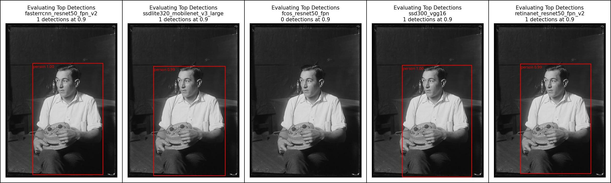
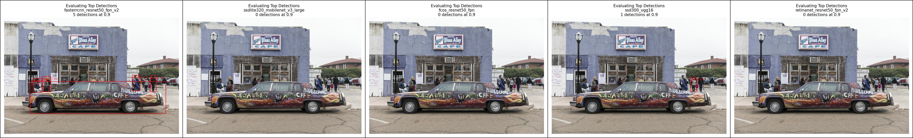
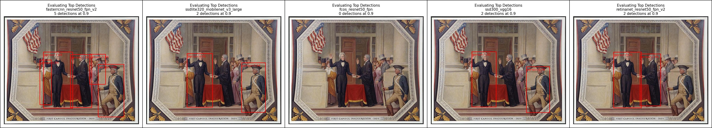
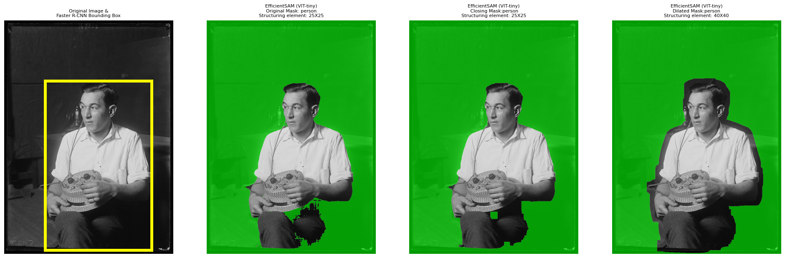
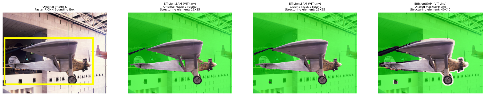

# Evaluation 

### Companion folder containing content used in the evaluation report.

## AI Planning Framework

| Title                     | Description                                                                                                                                               | Download                   |
|---------------------------|-----------------------------------------------------------------------------------------------------------------------------------------------------------|----------------------------|
| Use Case Risk Worksheet   | This questionnaire is meant to assist staff in assessing the risk profile of an AI use case. The risk level will inform planning for the level of the risk mitigation efforts, estimated timeline for safety, quality and performance verification, and resources required. | [Link to worksheet](https://github.com/beefoo/lclabs-jfp24/blob/main/evaluation/Use_Case_Assessment_Worksheet_2023_jfp_24.pdf).         |
| Phase II Risk Analysis    | Fill out this worksheet to articulate success criteria, measures, risks, and benefits for an AI Use Case.                                                   | [Link to worksheet](https://github.com/beefoo/lclabs-jfp24/blob/main/evaluation/Phase_II_Risk_Assessement_2023_10_30_jfp_24.pdf).         |
| Data Readiness Assessment | Questionnaire to assess readiness and availability of data for the proposed use case.                                                                      | [Link to questionnaire](https://github.com/beefoo/lclabs-jfp24/blob/main/evaluation/Data_Assessment_Worksheet_2023_jfp_2024.pdf).     |

# Object Detection Evaluation: 

One of the goals of our collage tool project is to utilize emerging technologies. To fulfill the goal of this project, we have elected to use an object detection model to detect subjects and objects from images and a segmentation model for instance extraction–as a way to simulate the “cut and paste” part of the collaging experience. **In this evaluation, we will focus solely on object detection, and review models with the Torchvision, Computer Vision library, by Pytorch. Although, there different frameworks avaiable, Pytorch was selected due to prominance within industries and ease of use.** (Further details on the models compared in this evaluation can be found below.)

| **Model Alias** | **Details** |
|-----------------|-------------|
| Faster R-CNN    | Faster R-CNN model with a ResNet-50-FPN backbone from [Benchmarking Detection Transfer Learning with Vision Transformers paper](https://arxiv.org/abs/2111.11429).<ul><li>Model: fasterrcnn_resnet50_fpn_v2</li></ul> |
| FCOS            | FCOS: Fully Convolutional One-stage Object Detection model with a ResNet-50-FPN backbone.<ul><li>Model: fcos_resnet50_fpn</li></ul> |
| RetinaNet       | Improved RetinaNet model with a ResNet-50-FPN backbone.<ul><li>Model: retinanet_resnet50_fpn_v2</li></ul> |
| SSD             | The SSD300 model is based on the SSD: [Single Shot MultiBox Detector paper](https://arxiv.org/abs/1512.02325).<ul><li>Model Doc: ssd300_vgg16</li></ul> |
| SSDlite         | SSDlite model architecture with input size 320x320 and a MobileNetV3 Large backbone, as described at [Searching for MobileNetV3](https://arxiv.org/abs/1905.02244) and [MobileNetV2: Inverted Residuals and Linear Bottlenecks](https://arxiv.org/abs/1801.04381).<ul><li>Model: ssdlite320_mobilenet_v3_large</li></ul> |

The models from the Torchvision package, though varying in architecture, were pretrained on the MS COCO dataset, which contains 2.5 million labeled instances in 328k images with 91 object categories [1]. 

For model comparison, we selected a confidence threshold of 90% and limited the models to label a maximum of five detected objects with the highest confidence. We then tested the models on a set of sample images from the LOC Free to Use and Reuse Data Package.

#### The example images below compare the performance of each model under these constraints. **From left to right: Faster R-CNN, SSDlite, FCOS, SSD, and RetinaNet.**

| Image Resource ID| Comparison |
|----------|----------|
|    2016887160  |     | 
|    2017879462  |        |
|    00650363    |       |

**Here is the [notebook]() used to generate these Pytorch Object Detection Model Comparisons.**

Based on our comparison grid observations, we can see that the Faster R-CNN model performs the best, due to its ability to detect a variety of objects with the highest confidence. Other models failed to produce such confidence, even in instances where objects in the images were isolated.

However, the Faster R-CNN has its limitations—some inherited from its training dataset. The model is able to isolate and detect people consistently with very high prediction rates; even the likeness of a person in paintings and statues, but errs in some instances in detecting individuals due to variations in image position or lighting, image quality (for example, objects in stereograph images are often not detected), and general ambiguity in the input image. The quality of the detection is of similar degree in regards to inanimate objects and animals within the scope of MS COCO dataset.

However, for any object categories outside of the training dataset, the model fails to make any accurate prediction or misclassifies the object (e.g. fish identified as bananas). The inability to identify buildings, landmarks, trees and plant life, and accessories could be a challenge for the completeness of our collage tool—as we conceived the use of  all of these items as parts of a creative collage to fill out a “city” background. However, this challenge might prove to be less of an issue during the segmentation process, or as we increase the quantity of images the user will have for exploration.

# Model Evaluation, Sample Collection Assessment:

This sections provides more detail on the findings laid out in the [Model Evaluation Document](https://docs.google.com/document/d/1QaFgv5XdfW14M27mQlKEWvRPwnjy5zOqTceb5-saGBw/edit?usp=sharing). While the [Model Evaluation Document](https://docs.google.com/document/d/1QaFgv5XdfW14M27mQlKEWvRPwnjy5zOqTceb5-saGBw/edit?usp=sharing) summarized testing on several object detection models, this document only focuses on the results of further testing done using our chosen model – the Faster R-CNN model.

The [Model Evaluation Document](https://docs.google.com/document/d/1QaFgv5XdfW14M27mQlKEWvRPwnjy5zOqTceb5-saGBw/edit?usp=sharing) tested the Faster R-CNN model on a randomized set of images from the Library’s[ Free to Use and Reuse](https://www.loc.gov/free-to-use/) collection. However, many of the images and collections we wanted to incorporate into our collage tool vary significantly from these initial, randomized images, particularly in terms of quality. 

We needed to test not only how the model would work with black and white or sepia toned images; hazy, blurry or otherwise unclear images; and images with limited lighting, but _if_ the model’s capture rate and accuracy would remain despite such characteristics. 

To do this, we curated a list of 46 images from collections of interest. Each team member selected at least 12 images, keeping in mind the following categories:

* Nature
* Landmark
* People
* Backdrop
* Vehicle

For each category, the amount of images selected were divided as follows:

* At least three images in the “Landmark” category.
* At least three images in the “People” category, paying attention to the color and focus of the image as well as the skin tone of the image’s subject.
* At least two images in the “Nature” (or “Animal”) category.
* At least two images in the Backdrop category (which included miscellaneous items like street lights or fire hydrants).
* At least two images in the “Vehicle” category.

Images could account for more than one category.

In the ‘Observation’ column of Table 1, we list observations about the Faster R-CNN model’s interaction with our sample collection set. In the ‘Description’ column of Table 1, we list out examples of each observation found in the ‘Observations’ column.

The observations in Table 1 will be used to create an assessment of our current iteration of the collage tool and what needs to be changed to better work with the capabilities of the Faster R-CNN model.

For a more generalized overview of what the Faster R-CNN model was able to capture from our sample collection, view the ‘sample-collections’ sheet in our [jfp-collections](https://docs.google.com/spreadsheets/d/1ASfJagQ74OEp1LOV15BI5GGWmBML_-Xw6_B8tzN39HE/edit?usp=sharing) spreadsheet.

When referencing an item from our sample collection, we will use the column letter and row number. For instance, C2.

| **Observation**              | **Description** |
|------------------------------|-----------------|
| Privileging of humanoid silhouettes | The model captures humanoid silhouettes the most consistently and with the largest/highest bounding box threshold.   In instances where the model would theoretically capture a building-like structure (or landmark), it will not if a humanoid silhouette is close by. C24 has a similar structure to C25, with very similar lighting conditions and background noise. However, the model captured the structure in C25, but not C24 (where a person in the background was captured alone).   It is worth noting that C25 is labeled as a “fire hydrant” by the model due to its shape. As such, it’s not read as a background item/building like C24.   Along these lines, the model is able to capture statues or illustrations in the shape of humans (C38).   See “Illustrations” for more information. |
| Sizing and Shape            | It seems that the positionality of the subject or object in an image impacts whether the model can capture said subject or object.   The cat in C2 appears in the model’s vocabulary, and the model is able to capture many other animals in its vocabulary, as seen in C8 (horses), C42 (dog) and C43 (sheep). C43 was a surprising capture since the image is damaged and washed out.   However, C2 was not able to be captured, and this may be due to the costume that is placed on the cat that may “obscure” the silhouette of the cat.   Initially, we thought that the cat was not able to be captured because of how large and central to the portrait it was, but the model was able to capture another close-up portrait (C19). |
| Shadows [Color/Shading]     | Skin tone does not appear to affect the efficacy of the model. People across skin tones were able to be captured.   This also applies whether the image is in color, black and white, or sepia-toned.   Shape recognition seems to play a bigger role in object detection. Take C11, as an example. Though the two people in the distance are not clearly shown, the model is able to pick up one of them. It seems that the issue here is the person not captured is not clearly “defined” in the image.   This explains images like C35. The image has ducks, which should be captured because “bird” is in the model’s vocabulary. However, unlike the near perfect capture of the ducks in C21, the lack of clarity in the image (and by extension, the shape of the duck), means that the ducks in C35 are not captured. The ducks in C35 blend with the background (no defined lines). |
| Inconsistent capture        | The model often inconsistently captures objects and subjects in its vocabulary.   There does not seem to be a pattern to or reason for this, including shape (mis)recognition (as seen with C1).   For examples, view the following images: <ul><li>C4: Students, chairs, and desks not all captured, even where there is presumably no hindrance to recognition.</li><li>C17: Not all subjects captured, even without hindrance to recognition.</li><li>C39: Not all subjects captured, even without hindrance to recognition.</li><li>C40: Not all subjects captured, even without hindrance to recognition.</li></ul> |
| Clustering/Grouping         | How the clustering or grouping of subjects or objects affects object detection is indeterminable. There are objects or subjects captured even when grouped together and others that are not – even when grouped together.   Take C41 as an example. There are two objects with wheels captured. One is a cart and the other is a bicycle. The model is able to detect the bicycle, even though it is grouped with subjects and another object (a cart). However, the cart is not able to be captured despite being more forward and clearer in the image, even though grouped with subjects (ruling out the “privileging of human silhouettes” observation previously noted). |
| Illustrations               | The model does not capture anything from illustrations. See C10 and C12. |

_Table 1: Assessment of Faster R-CNN model applied to sample collection._

In general, the model will capture something _if_ it can relate it to a structure in its training model, as seen with C31, where a part of a car is labeled as a person and C25, where a building structure is labeled as a “fire hydrant.” If something “distorts” the expected shape of an object or subject (see C1), then the model will not recognize the object or subject, even if they are in the model’s vocabulary.

_From left to right: structure not ordinarily captured mislabeled as “fire hydrant” (C25)[2] and part of car mislabeled as “person” (C31)[3]. “Brünnhilde” cat not captured due to headdress and clothing. [4]_

Given the shortcomings of the model, our initial project deliverable has shifted. We had hoped that users would be able to manipulate items in the “Landmark” category. However, the model is not able to capture buildings or any landscape. As such, anything within this category will be presented as an uneditable background upon which users can place capturable objects and subjects.

# Image Segmentation, EfficientSAM: 

Compared to the approach used to evaluate the Object Detection Models, which determined the use of the Faster R-CNN model, the Image Segmentation process was experimentation-based. Due its wide use, the EfficientSAM (VIT-tiny) model was selected [5]. 

Using bounding box predictions from the previous model, the EfficientSAM model generated a mask outlining the detected object. Further tuning was conducted using morphological image processing to ensure that the masks were able to completely define an the contours of an individual or object.

| Image Resource ID| Comparison |
|----------|----------|
|    2016887160  |     | 
|    2011633149  |     | 

**Here is the [notebook]() used to generate these Image Segmentation and Processing Comparisons.**

# References

[1] Lin, T.-Y., Maire, M., Belongie, S., Bourdev, L., Girshick, R., Hays, J., Perona, P., Ramanan, D., Zitnick, C. L., & Dollár, P. (2014). Microsoft coco: Common objects in context. https://doi.org/10.48550/ARXIV.1405.0312

[2] Highsmith, C. M., photographer. Cherry trees along the Tidal Basin with Japanese Lantern placed in the park in . Washington, D.C. Washington D.C. Washington D.C. United States District of Columbia, None. [Between 1980 and 2006] [Photograph] Retrieved from the Library of Congress, https://www.loc.gov/item/20116332

[3] Harris & Ewing, photographer. (1937) Washington youngster solves parking problem. Washington, D.C., March 30. Transportation and no parking worries. Nelm Clark, 16-year old Washington youngster, solved this problem by combining a lawn mower motor with a set of motor cycle gears to make this unusual midget auto. Costing $60 to build the contraption weighs only 150 pounds--the weight is its main feature--and if you run out of gas you easily push it or tuck it under your arm and walk home, 3/30. Washington D.C. Washington D.C. District of Columbia United States, 1937. [Photograph] Retrieved from the Library of Congress, https://www.loc.gov/item/2016871444/.

[4] Weidhaas, A. E., photographer. (1936) Brünnhilde. , 1936. [Photograph] Retrieved from the Library of Congress, https://www.loc.gov/item/2017645524/.

[5] Xiong, Y., Varadarajan, B., Wu, L., Xiang, X., Xiao, F., Zhu, C., Dai, X., Wang, D., Sun, F., Iandola, F., Krishnamoorthi, R., & Chandra, V. (2023). Efficientsam: Leveraged masked image pretraining for efficient segment anything. https://doi.org/10.48550/ARXIV.2312.00863

[6] Harris & Ewing, photographer. Wash. radio show. The latest in spring styles for men. A radio set in a straw hat. Washington D.C. United States District of Columbia Washington D.C, None. [Between 1921 and 1924] [Photograph] Retrieved from the Library of Congress, https://www.loc.gov/item/2016887160/

[7] Highsmith, C. M., photographer. Charles Lindbergh's "Spirit of St Louis" airplane, hanging at the Smithsonian Institution's Air and Space Museum on the National Mall, Washington, D.C. District of Columbia United States Washington D.C. Washington D.C, None. [Between 1980 and 2006] [Photograph] Retrieved from the Library of Congress, https://www.loc.gov/item/2011633149/.

