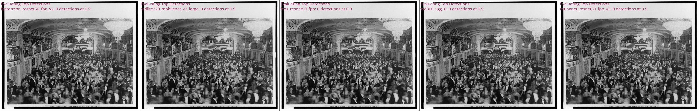
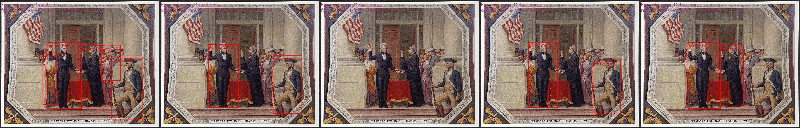
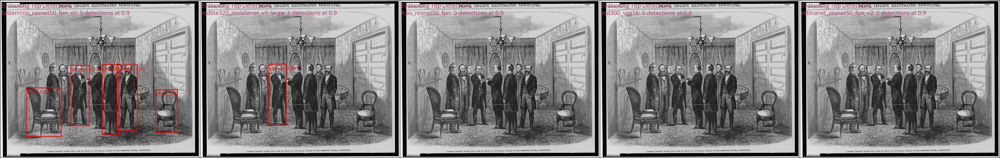

# Evaluation 

### Companion folder containing content used in the evaluation report.

## AI Planning Framework

| Title                     | Description                                                                                                                                               | Download                   |
|---------------------------|-----------------------------------------------------------------------------------------------------------------------------------------------------------|----------------------------|
| Use Case Risk Worksheet   | This questionnaire is meant to assist staff in assessing the risk profile of an AI use case. The risk level will inform planning for the level of the risk mitigation efforts, estimated timeline for safety, quality and performance verification, and resources required. | Link to worksheet.         |
| Phase II Risk Analysis    | Fill out this worksheet to articulate success criteria, measures, risks, and benefits for an AI Use Case.                                                   | Link to worksheet.         |
| Data Readiness Assessment | Questionnaire to assess readiness and availability of data for the proposed use case.                                                                      | Link to questionnaire.     |

# Object Detection Evaluation: 

One of the goals of our collage tool project is to utilize emerging technologies. To fulfill the goal of this project, we have elected to use an object detection model to detect subjects and objects from images and a segmentation model for instance extraction–as a way to simulate the “cut and paste” part of the collaging experience. **In this evaluation, we will focus solely on object detection, and review models with the Torchvision, Computer Vision library, by Pytorch. Although, there different frameworks avaiable, Pytorch was selected due to prominance within industries and ease of use.** (Further details on the models compared in this evaluation can be found below.)

The models from the Torchvision package, though varying in architecture, were pretrained on the MS COCO dataset, which contains 2.5 million labeled instances in 328k images with 91 object categories. 

For model comparison, we selected a confidence threshold of 90% and limited the models to label a maximum of five detected objects with the highest confidence. We then tested the models on a set of sample images from the LOC Free to Use and Reuse Data Package.

#### The example images below compare the performance of each model under these constraints. **From left to right: Faster R-CNN, SSDlite, FCOS, SSD, and RetinaNet.**

| Image | Comparison |
|----------|----------|
|    image_00650358.jpg    |       |
|    image_00650363.jpg    |       |
|    image_00650921.jpg    |        |
|    image_00650923.jpg    |        |
|    image_00650930.jpg    |        |

# Segmentation Evaluation: 

